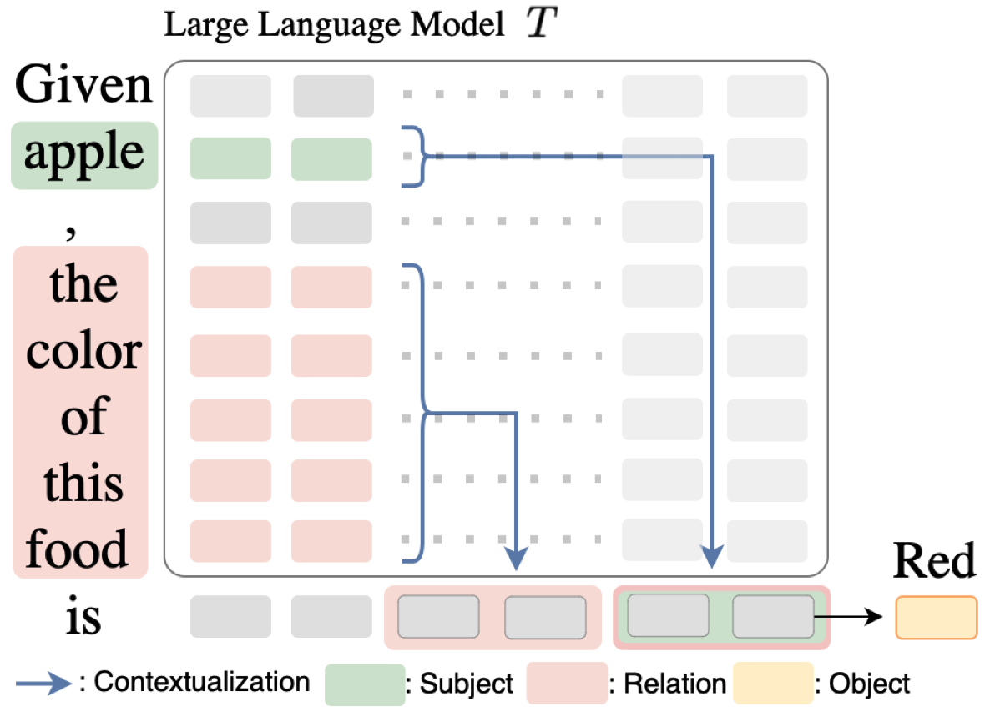

# Locate_Extract_Relation
The code for "Locating and Extracting Relational Concepts in Large Language Models". Findings of ACL2024. https://arxiv.org/abs/2406.13184

We observe that, during knwoledge recall process, there are some hidden states only encode the relation information.

<p align="center">

</p>

## Setup
* Install dependencies: `pip3 install -r requirements.txt`

## Data
We provide the Country-Capital file in data folder. 
More data could be found in [Linearity of Relation Decoding in Transformer LMs](https://github.com/evandez/relations)

## Experimens
* Run the Demo.ipynb

## How to Cite
```bibtex
@article{wang2024locating,
  title={Locating and Extracting Relational Concepts in Large Language Models},
  author={Wang, Zijian and White, Britney and Xu, Chang},
  journal={arXiv preprint arXiv:2406.13184},
  year={2024}
}
```